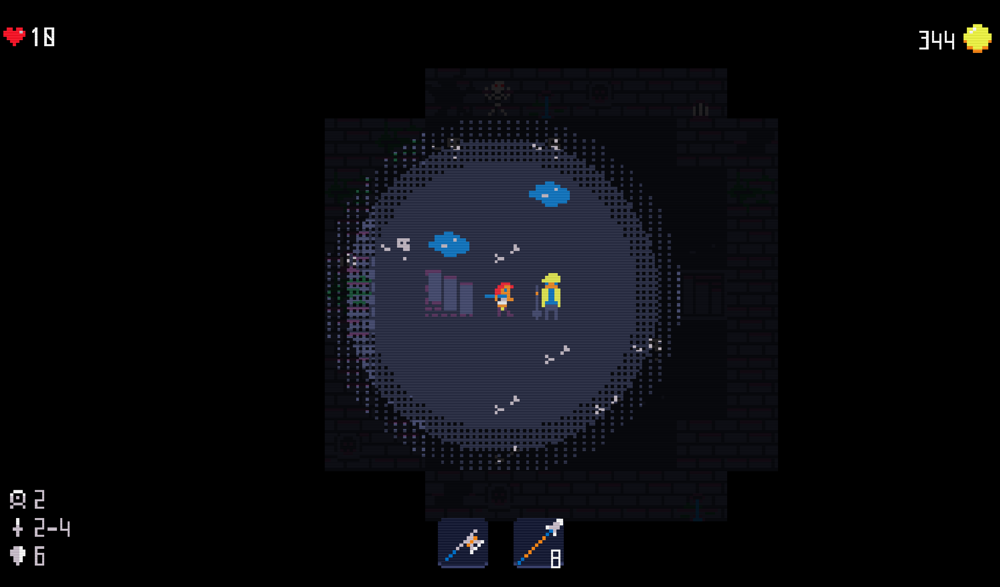
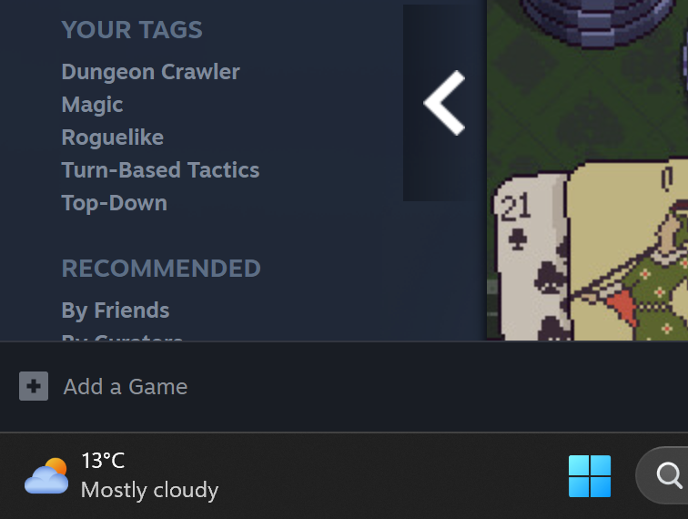
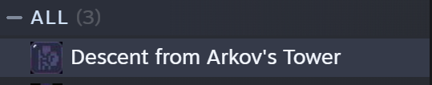
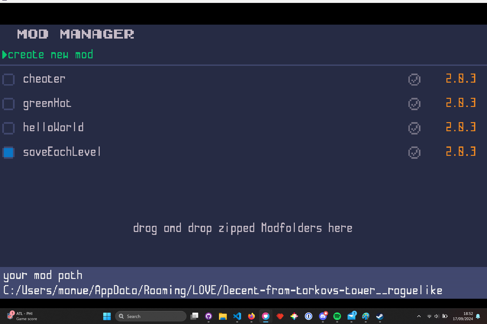

# Playtest from 2024/09/18

First of all thank you for joining my playtest. I hope you will have some fun.

# Intro

The Game we will playtest today is [Descent from Arkovs Tower](https://store.steampowered.com/app/2876720/Descent_from_Arkovs_Tower/).

Descent from Arkov's Tower is a retro pixelart topdown roguelike I programmed within the last 2 years. It is made with löve a Lua Framework. IT is also highly moddable, so please if you have the time today, try to download some of the already available mods, maybe try to create and upload your own. I would be especially interested if this is possible with the Steamdecks and Handhelds.

The planed Releasedate is end of Oktober 2024, but you will today get a test key in advance, as far as I know this key should stay valid even after I release the game.

The version you can play today consists of several levels, some of them are still in a WIP state, you will recognize WIP level as they contain a pixel construction worker and are very short. These are levels which are not yet finished and what I will have to do in the next 6 weeks :D.

  

# Todays Target
1. I want to see the game running on several devices
2. I want to catch some Bugs prerelease
3. I want to know if you think anything is weird / hard to undertsand
4. I want to know if there are things you don't like
5. Bonus if you think something was particularly fun - let me know aswell :D

## Lets get it running on your device
1. Ask me for your pfivate Key (yes private, keep that one you only get one :D)
2. Open Steam
3. In the Lover left corner of your steam app you should see the Option "+ add a game"
4. click and select activate a product on steam
5. Enter the Key you were provided

  

6. Now you should have a new entry in your Library: Descent from Arkovs Tower

  

## Start the game
You will be greated with a Menu, before you start doing anything, please navigate to "Mods" and read out the local path of all the games files, we will need that one if your instance crashes. This is where the important Log.log file will be created. I will need the latest version of that file if the game crashes in order to understand what happened ;-).

On Windows this is usually: `C:\Users\manue\AppData\Roaming\arkovsTower`

Bellow you see an example of my local build which is in a different place ;-)

  

## Catch Bugs
There are 3 Types of Bugs For each one of you I will tell you hwo to document it

### Crashes
A crash ends the execution of the game imediatly. There will be a wall of text of some sort.

What to do if you encounter one
1. Screenshot the Crashscreen
2. navigate to the modpath (see [Start the game](#start-the-game))
3. Copy the Log.log file
4. if you have a git account please create a new issue here: https://github.com/Saturn91/DescentFromArkovsTowerWiki/issues
5. if you don't have a git account, please mail the screenshot and the Log.log file to: saturn91.gamedev@gmail.com
6. After documenting the crash you usually can just close and restart the game and it should restart you might loose some progress (e.g. purchased player types) but don't worry Saturn91 can help you get them back.

### Game breaking Bugs
A bug which locks you in, you will no longer be abler to finish the game, exit the menu, but the game does not crash

1. Ask Saturn91 if that is supposed to happen, maybe you missed something
2. if not please document either as a gihthub issue https://github.com/Saturn91/DescentFromArkovsTowerWiki/issues
3. or send a mail to saturn91.gamede@gmail.com

### Small inconviniences or weird behaviors
1. Ask Saturn91 if that is supposed to behave that way, explain ahat you would have had expected

# Lets start Testing
1. Start the game
2. copy your mod path from the Mod menu if not already done
3. Start a run and try not to die
4. die (or win :D)
5. Do you have some feedback already at this point, let Saturn91 know.
6. Play some more
7. As my game is also highly moddable, please try to install one of the mods from the [workshop](https://steamcommunity.com/workshop/browse/?appid=2876720&browsesort=trend&section=readytouseitems), can you find out how?
8. If you have the time, try to create and run your own modfile, can you maybe change something in the game?