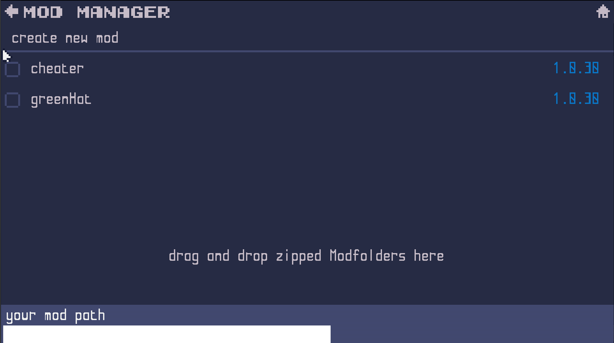

<a href="../README.md">back</a>

# Modding

## Content
- [creating and compiling new Mods](mod-creation.md)
- [graphic assets](graphics/index.md)

## Summary
Modding in Descent from Akrov's tower is intended to be straight forward. You can simply start the game and will find an Option "Mods" in the main menu which leads you to the Modmanager. The Modmanager shows a list of available mods. By default you will get the "cheater" and the "greenHat" mod. These serve as simple examples how a mod could look like. In addition to that this Page is also where you create new mods. This happens with the option "create new Mod" at the top of the page. Created mods will by default contain all the content which is originally in the game. This allows you to see how I as a developer work with the mod tool.

