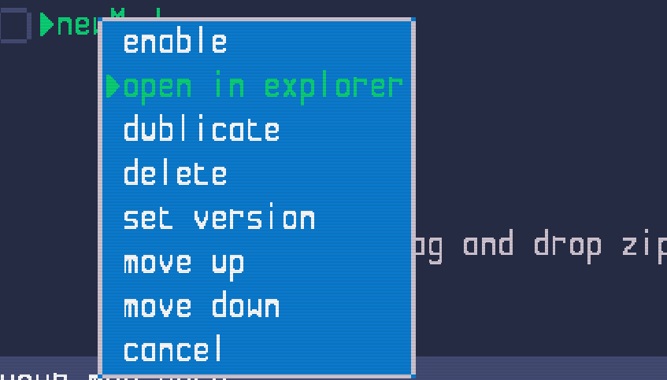
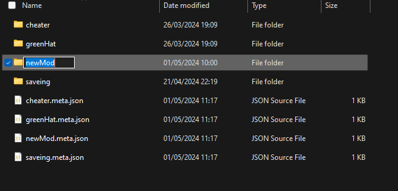
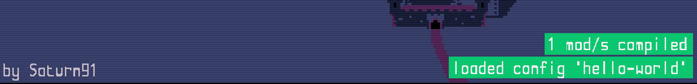

<a href="index.md">back</a>

>If you stumble upon anything outdated, please reach out via [discord](https://discord.gg/uJjuuAH5uX)

# Create a new mod
Everything related to mods happens in the game's modmanager. You will find it in the main menu under "Mods".

In order to create a new Mod, simply press the option "create new Mod" on top of the Page.

This will create a new Mod "newMod" in the mod list bellow.

| Please note that only one item called "newMod" can be contained in the list. In order to add a second mod, you need to [rename](#rename-a-mod) the existing "newMod" first.

# Good practice
In order to keep the mod size to a minimum, it is good practice to delete all files that you didn't change. In case several mods are enabled, this allows the combination of multiple mods.  This practice also reduces the size of your mod folder if you share it with other people.

# Editing a mod
A mod is nothing more than a folder in your system's File Explorer which contains alternative files to the default files that get shipped with an unmodded game. All files included in this "mod working directory" will be used in a newly started game instead of the original ones. This allows you to easily change the content of the game.

## Open a mods working directory
Accesing a mod's working directory is as simple as opening its context menu and selecting the option, "open in explorer." This will open the specified folder in your system's file explorer.

  

Alternativly, you can navigate manually to the path that is shown at the bottom of the page.

## Rename a mod
In order to rename a mod, simply [open its working directory](#open-a-mods-working-directory) in your system's file explorer, navigate one layer up, and rename as you think fits.

This renames the mod and how it is displayed in the modmanager. In order to see the new name, navigate to the main menu and reopen the modmanager. This updates the displayed name.

## Change a mods config name
Each mod contains a file `main-config.mod.json.` This file has a property "config" which identifies the mod. It is used to display which mod is currently active. If you do not change this, the mod will always be identfied as default "newMod" which is not ideal. In order to change this, open the file "main-config.mod.json" from the working directory with any text editor and edit the value to a more fitting name (e.g. the name of the working folder).

  

Also change the actual folder's name from `newMod` to something like `myAwesomeMod`. 

> When renaming the mod folder, make sure to use only letters (special characters can confuse some operating systems). A good practice is to use a `camelcase` pattern. E.g. `balancingUpdate`.

> Names like `paladin-player` or `spanish_localization` or `more levels` might cause issues on some systems

# Enable and Compile
In order to add a mod to your game, you simple have to enable it. This happens in two simple steps.

1. use the "enable" option in the mod's context menu
2. to compile the mod, return to the main menu
3. you will see a message "loaded config [your mod name]"

After navigating back to the game (Escape key or using the Back or Home Button), you will see a message in the bottom right telling you that 1 mod has been installed. Now the modded content will be available as soon as you start a new game.

You can [change its config name](#change-a-mods-config-name) to a better-fitting name.

