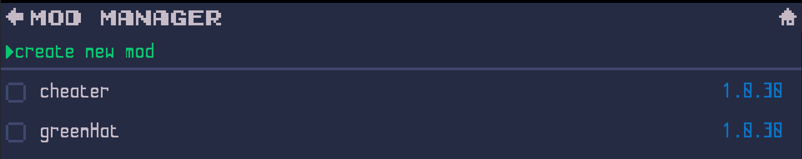
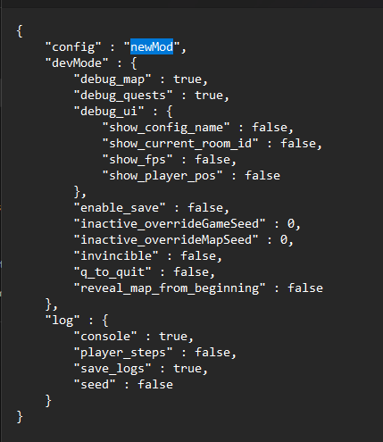

<a href="index.md">back</a>

# Create a new mod
Everything related to mods happens in the games modmanager. You find it in the mainmenu under "Mods".

In oder to create a new Mod simply press the option "create new Mod" on top of the Page.

This will create a new Mod "newMod" in the mod list bellow.

| Please note that only one item called "newMod" can be contained in the list, in order to add another one, you need to [rename](#rename-a-mod) the existing "newMod" first.

# Good practice
In order to keep the mod size to a minimum it is good practice to delete all file which you didn't change. In case several mods are enabled, this allows the combination of multiple mods, also it reduces the size of your mod folder if you would share it with other people.

# Editing a mod
A Mod is nothing else than a folder in your systems File Explorer which contains alternative files to the default files which gets shipped with an unmodded file. All Files included in this "working directory" will be used in a newly started game instead of the original ones. This allows you to fairly simply change the content of the game.

## Open a mods working directory
Accesing a mods working directory is as simple as opening its context menu and select the option "open in explorer" this will open the according folder in your systems file explorer.

  

Alternativly you can navigate to the path which is shown at the bottom of the page, manually.

## Rename a mod
In order to rename a mod, simply [open its working directory](#open-a-mods-working-directory) in your systems file explorer, navigate one layer up and rename as you think fits.

This renames the mod and how it is displayed in the modmanager. In order to see the new name, simply navigate to the main menu and reopen the modmanager. This should update the displayed name.

## Change a mods config name
Each mod contrains a file `main-config.mod.json` this files has a property "config" which identifies the mod. It is used to display which mod is currently active. If you do not change this, the mod will always be identfied as default "new mod" which is not ideal. In order to change this, open the file "main-config.mod.json" from the working directory with any text editor and edit the value to a more fitting name (e.g. the name of the working folder).

  

# Enable and Compile
In order to add a mod to your game, you simple have to enable it. This happens in two simple steps.

1. use the "enable" option in the mod's context menu
2. to compile the mod, return to the main menu
3. if you see a message "loaded config [your mod name]"

After navigating back to the game (Escape key or using the Back or Home Button) you will get a Message in the bottom right telling you that 1 mod has been installed. Now the modded content will be available as soon as you start a new game.

You can [change its config name](#change-a-mods-config-name) to a better fitting name.

