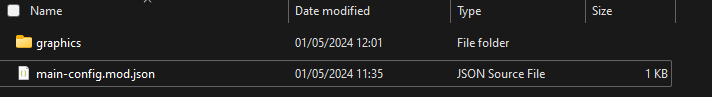

<a href="../index.md">back</a>

>If you stumble upon anything outdated, please reach out via [discord](https://discord.gg/uJjuuAH5uX)

# Graphic Assests
This section will guide you trough the steps of creating a mod which will overhall graphic assets.

 - We will change how some enemies look

## Step 1 create a new Mod called "my-graphic enhancement"
Follow the steps here and come back afterwards.
1. [create a new mod](../mod-creation.md#create-a-new-mod)
2. [rename mod](../mod-creation.md#rename-a-mod)
3. [open mod in working directors](../mod-creation.md#open-a-mods-working-directory)

## Step 2 understand the structure of a mod (graphics)
All the graphics assets which are currently used in the game, are available within a mods working directory. The folder graphics contains these. Descent from Arkov's Tower uses Spritesheets for most of it graphics. These are image files which are sectioned into smaller images (tiles). In order to edit the graphics with your art, you simply have to replace the existing images witch your own.

## Step 3 delete not needed files
In order to keep your mod small and follow the [good practices](../mod-creation.md#good-practice) we will no delete all unescesairy files from the mod, as we will only update the graphics and nothing else.

1. identify the images within the "/graphics" folder which you want to change. In my case this would be: "MinimalisticRogueLikeSpriteSheet.png" for the enemies. In addition to that we also keep the image "color-palette" which contains all the games original colors.
2. delete the other images within "/graphics"
3. Navigate one level up to the working directories root. In here delete everything except for the main-config.mod.json (to keep the name of the mod) and the "/graphics" folder.

## Editing the images
To make sure everything works as expected, you need an image editor which allows the usage of transparency. Also ideally it should support tile grids as this will make your life easier. For the creation of my game assets I used [PixelEdit](https://pyxeledit.com/index.php) which is available for a small few. As you probably just start out, I will use the free online tool [piskelApp](https://www.piskelapp.com) in this tutorial. I would recommend sticking to a free tool for now.

### Open Piskel App and import the MinimalisticRogueLikeSpriteSheet.png
1. navigate to: https://www.piskelapp.com/p/create/sprite
2. find the option "IMPORT" on the right bottom side of the page

  

3. Select "browse images" to import an image
4. Navigate to your mods working directory and to the "/graphics" folder
5. Select the "MinimalisticRogueLikeSpriteSheet.png"
6. In the Wizzard which opens select "import as spritesheet" and change the FrameSize to 16x16

  

7. Finish importing by hitting "import"
8. If a Popup opens - just click OK

### (Optional) import the color palette
I included the Color palette within the mod file so you can use the exact same colors as I did when I drew the assets. In order to use them in Piskel, you can import a color palette

1. find the "create a new palette option"

  

2. In the wizzard select "import from file"
3. select "color-palette.png" from the "/graphics" folder
4. click "save"

### Add Sunglasses to the rats sprites
1. select the first rat sprite on the left
2. When you see the rat in the big edit window change its sprite using the colors in the palette
3. You can also do this to other enemies if you like.

### Export your image
1. Export your changes -> find the option "Export" on the right of the editor

  

2. Select "PNG" as filetype
3. Click "Download" under "Spritesheet file export"

  

4. You will then find a new image in your download folder which has the same name as the file you originally imported e.g. "MinimalisticRogueLikeSpriteSheet.png".
5. Move this file into the "/graphics" folder of your mod working directory and replace the original image.

### Test your changes
Do the following steps
1. [enable and compile](../mod-creation.md#enable-and-compile) your mod
2. Start the game and play until you see a rat
3. rejoce!

  

