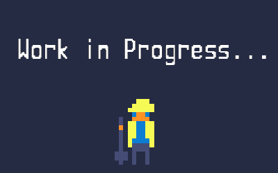

<a href="./minimalistic-generator.md">back</a>

# Fill your map with map objects and enemies

  

# Lets now dive into how you can implement your own ideas

<a href="./next-steps.md" style="margin-left: 48px; font-size: 24px">-> next step</a>