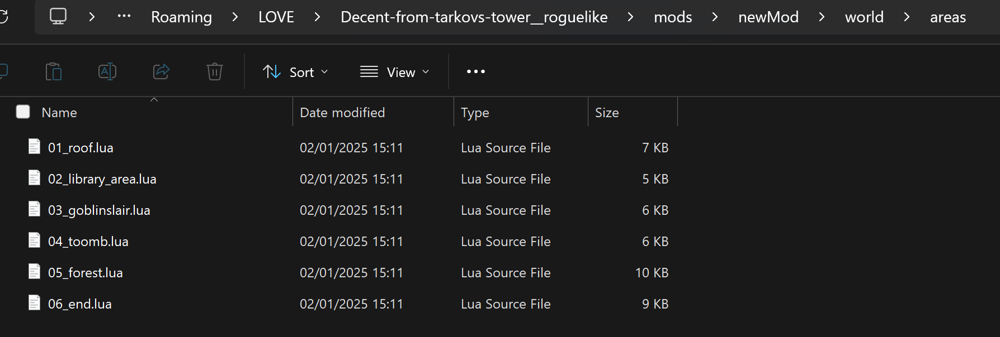
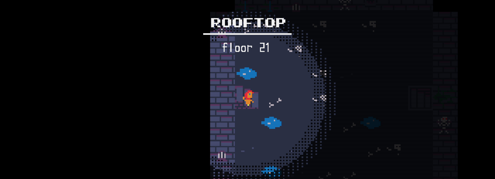
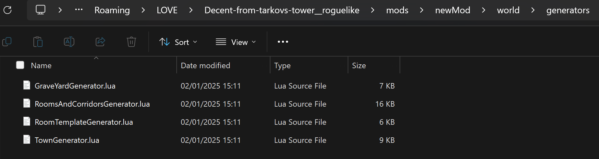

<a href="../index.md">back</a>

>If you stumble upon anything outdated, please reach out via [discord](https://discord.gg/uJjuuAH5uX)

# Create your own Map generator
Creating your own Map generator can be challenging, but no worries we will go trough it step by step. At first we will go trough the basic in order to make you familiar with the basics.

In this Tutorial I will
- dive into how costum generators can be added to the game
- explain at the general structure of the code
- give an example for a minimalistic generator (generating a simple square level)
- point to further sources on how to start developing your own generator

# Creating the mod
At this point you should already know how to create a new mod. Just in case, it is all described [here](../../mod-creation.md). Name your mod `MyGenerator`. You can now delete all folders and files except the `world` folder and the `main-config.mod.json` which you can use to also label your mod.

# Locating the files we need to adapt
To get started I will give you an overview of the files with which we will need to work with.

Descent from Arkovs Tower is a game which is based on levels and areas. The initially shipped game on release contained 6 areas, most of them contained 3 levels each. Each area has its own config file which is located in the `world/areas` folder of each mod.



## Area file

Lets now take a look at the 02_library_area.lua file. As you can see bellow the file is structured in a specific way as all area files.

> note: the number at the beginning is used to order the area files in the order the will appear in the game

Right at the top, there are some constants defined. Lets ignore these for now. We are more interested in the object which gets returned.

As you can see there are the following properties:
- name: the translation key for the area's name (displayed on top when you enter a level of the area)
- tileset: this is optional, if left blank, it will take the default tileset: `DefaultDungeonTiles.png`
- levels: this is an array of all the levels contained in the game

```lua
--------------CONSTANTS-------------
local w = "w"
local P = "P"
local s = "s"
local S = "S"
local W = "W"
local d = "d"
local F = "F"
local a1 = "a1"
local a2 = "a2"

return {
    name = "level_titles.02.title",
    tileSet = "Library.png",
    levels = {
        --------------LEVEL 1-------------
        {
            name = { id = "level_titles.generic.floor", variables = { floor = 15 } },
            generator = "room-corridor",
            definition = {
                lootTable = {
                    common = {
                        "health pot.",
                        "health pot.",
                        "apple",
                        "apple",
                        "md hl pot."
                    }
                },
                enemies = { "cursed_book", "bookworm" },
                size = { w = 25, h = 25 },
                maxRoomCount = 10,
                roomSizes = {
                    x = { min = 5, max = 7 },
                    y = { min = 3, max = 5 }
                },
                enemiesPerRoom = { min = 2, max = 4 },
                roomObjects = {
                    propability = 1,
                    objects = {
                        oneTime = {
                            "chest",
                            "chest"
                        },
                        random = {
                            "statue",
                            "firebowl",
                        }
                    }
                }
            },
        },

        --------------MORE LEVELS ...-------------
    }
}
```
### Levels
Lets now look at one specific level. In the code above I only keeped the code for one level.

Each level has:
- name: the translation key for the name which will displayed if that level is entered.
- generator: this one is optional, if it is left blank the default generator is used (as in Level 1-2), we use it to reference different generators which can be modded.
- definition: the definition holds level specific costum informations which will be used by the generator. This can be the size of the level, which enemies to spawn and mapobjects to be placed. 


This is how the area / level title gets displayed


## Generators
The base game already comes with a few predefined generators. These are located in a mod's subfolder `world\generators`. Feel free to have a look at the files and take them as inspiration for your own creations.



### Predefined Generators
1. Default Generator -> not listed in the moddable generators
2. GraveYardGenerator.lua -> This generator makes use of the cellular automata algorythm to create the graveyard of level 6-2.
3. RoomsAndCorridor.lua -> This generator places as many rooms as possible in a given area, then tries to connect all of them. In the end it removes not yet connected rooms. It is used in the 2nd area of the game.
4. TownGenerator.lua -> makes again use of the cellular automata algorthm to generate the town in 6-1

# Lets now look at the basic structure of a generator script

<a href="./generator-structure.md" style="margin-left: 48px; font-size: 24px">-> next step</a>
