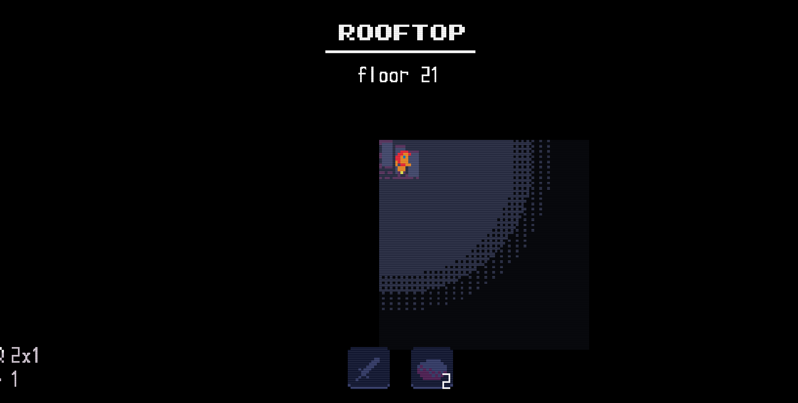
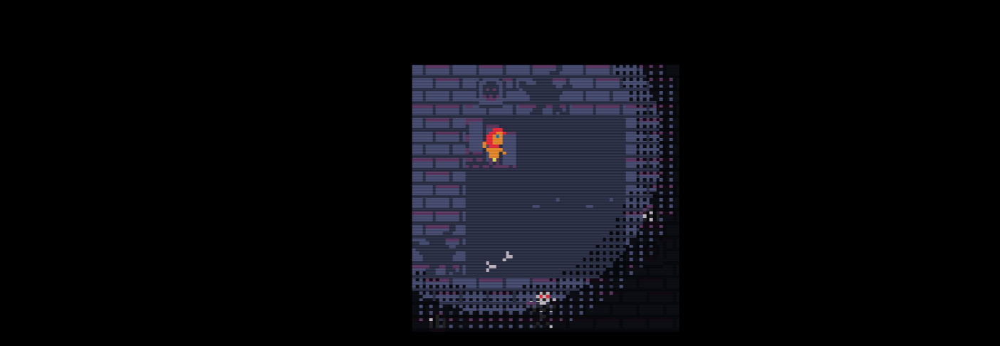

<a href="./generator-structure.md">back</a>

# A Minimalistic Generator

In this section we will create a generator for a simple rectangular level. The size can the be defined in the level's definition.

Lets have a look at the `asyncInit` function which are going to need.

## Generating a rectangle in asyncInit
As already teased the `asyncInit` function has to return a specific object. Lets have a look at it (the comments should explain most of the fields)

```lua
function MyGenerator.asyncInit(definition, player)
    -- TODO ... actually generate the level

    return {
        generatedMap = {
            collisionMap = collisionMap,                        -- 2dim boolean array representing the map -> true = walkable, false = not walkable
            spriteMap = spriteMap,                              -- 2dim array of the sprite indicies for each tile of the map
            rooms = {},                                         -- optional, the default generator also defines specific rooms
            size = Array2DUtil.get2DimArraySize(collisionMap),  -- a 2d vector with the width (w) and height (h) of the given level 
            stairPos = exitPos                                  -- a 2d vector, position of the tile which teleports the player to the next level 
        },
        spriteData = nil,                                       -- optional, custom sprite data if the levels spritemap uses a different layout then default
        blockedPath = nil,                                      -- optional, array of vec2 -> a critical path from entry to exit which can not be blocked
        mapObjects = nil,                                       -- optional, array of mapobjects
        stairPos = exitPos                                      -- again 2d vector, position of the tile which teleports the player to the next level
    }
end
```

Now it is only a question of filling the given data. Lets replace this TODO comment with some code.

## Initially Generating the collisionmap
As the collisionmap is a 2dim boolean area it is fairly easy to implement for a rectangular map. We just take the size of the map and add a one tile thik border of non walkable tiles.

The code bellow will:
1. get the size of the level (remember that property size which we check for in the validate function?)
2. We initizalize a 2dim array so that the player can walk everywhere. I use the function `Array2DUtil.initialize2DimArray` for this
3. pass this into the `collisionMap` variable

> we will add some walls to this later

```lua
function MyGenerator.asyncInit(definition, player)
    local collisionMap = Array2DUtil.initialize2DimArray(definition.size.w, definition.size.h, true)

    return {
        -- ...
    }
end
```

## Initially add some sprite data
Lets also define which tiles we want on the floor.

1. again initialize a 2dim array with the same size, but this time we make use of the `Tile.getRndFloorTileIndex(true)` function. As we pass true, it will return the default floor tile.

```lua
function MyGenerator.asyncInit(definition, player)
    local collisionMap = Array2DUtil.initialize2DimArray(definition.size.w, definition.size.h, true)

    --add these 2 lines
    local spriteMap = Array2DUtil.initialize2DimArray(definition.size.w, definition.size.h,
        Tile.getRndFloorTileIndex(true))

    return {
        -- ...
    }
end
```

## Define the exit position
The stairPos is a 2dim vector which hold the position of the teleport to the next level. In our case, lets just define this as on the right side of the level and vertically centered.

```lua
function MyGenerator.asyncInit(definition, player)
    local collisionMap = Array2DUtil.initialize2DimArray(definition.size.w, definition.size.h, true)

    local spriteMap = Array2DUtil.initialize2DimArray(definition.size.w, definition.size.h,
        Tile.getRndFloorTileIndex(true))

    -- add these 4 lines bellow 
    local exitPos = {
        x = definition.size.w - 1,
        y = math.floor(definition.size.h / 2) --round to nearest integer (full number)
    }

    return {
        -- ...
    }
end
```

## Define the placePlayer function
Initially we make this simple, we just place it in the top left corner.

```lua
function MyGenerator.placePlayer(player, options)
    player:setPosition({ x = 1, y = 1 })
end
```

## lets finalize the returned object
Just make sure it looks exactly as shown bellow.

```lua
function MyGenerator.asyncInit(definition, player)
    local collisionMap = Array2DUtil.initialize2DimArray(definition.size.w, definition.size.h, true)

    local spriteMap = Array2DUtil.initialize2DimArray(definition.size.w, definition.size.h,
        Tile.getRndFloorTileIndex(true))

    local exitPos = {
        x = definition.size.w - 1,
        y = math.floor(definition.size.h / 2)
    }

    return {
        generatedMap = {
            collisionMap = collisionMap,
            spriteMap = spriteMap,
            rooms = {},
            size = Array2DUtil.get2DimArraySize(collisionMap),
            stairPos = exitPos
        },
        stairPos = exitPos
    }
end
```

## Lets test.
Lets run this. Make sure to reload the mod by
1. open the mod manager
2. make sure the mod is enabled
3. hitting escape

Now start a new game using what ever player and difficulty. If you have followed along correctly you should now see our generated rectangle.

This would be the expected result. If this is not the case, please check the next paragraph for trouble shooting.



If everything worked, please skipp the trouble shoot section.

## Trouble shoot
If anything went wrong please check
1. Did you add a new level referencing this script?
2. Did you add a size property `size = { x = 5, y = 5}` to the definition?
3. Did you add a lootTable property `lootTable = { common= {} }` to the definition
4. Does your generator script exactly match the bellow structure
5. Did you enter the mod manager, ensure that the mod was enabled and hit esc to reload the script?

```lua
-- complete script for the generator
local MyGenerator = {}
MyGenerator.id = "my-generator-id"

function MyGenerator.asyncInit(definition, player)
    local collisionMap = Array2DUtil.initialize2DimArray(definition.size.w, definition.size.h, true)
    local spriteMap = Array2DUtil.initialize2DimArray(definition.size.w, definition.size.h,
        Tile.getRndFloorTileIndex(true))

    local exitPos = {
        x = definition.size.w - 1,
        y = math.floor(definition.size.h / 2)
    }

    return {
        generatedMap = {
            collisionMap = collisionMap,
            spriteMap = spriteMap,
            rooms = {},
            size = Array2DUtil.get2DimArraySize(collisionMap),
            stairPos = exitPos
        },
        stairPos = exitPos
    }
end

function MyGenerator.placePlayer(player, options)
    player:setPosition({ x = 1, y = 1 })
end

function MyGenerator.validate(level)
    local parsedName = json.stringify({ level.name }, true)
    local definition = level.definition

    if not definition.size then
        return false, "MyGenerator: size is required: " .. parsedName
    end

    return true
end

return MyGenerator

```

## Lets improve our generator
The map we generated was a tiny bit to minimalistic. I see the following issues:

1. There are no walls
2. It just uses the default floor tiles
3. The exit is not visible

## Adding walls (collision only)
Walls are non walkable tiles, so we need to update the collision map AND change the spriteMap. So lets start with the collision map

1. we will loop trough all tiles and
2. if they are on x == 1 or y == 1 we make them not walkable
3. if they are on x == size.w or y == size.h we make them not walkable

```lua
function MyGenerator.asyncInit(definition, player)
    local collisionMap = Array2DUtil.initialize2DimArray(definition.size.w, definition.size.h, true)
    local spriteMap = Array2DUtil.initialize2DimArray(definition.size.w, definition.size.h,
        Tile.getRndFloorTileIndex(true))

    -- add this double for loop
    for x = 1, definition.size.w do
        for y = 1, definition.size.h do
            if x == 1 or x == definition.size.w or y == 1 or y == definition.size.h then
                collisionMap[x][y] = false
            end
        end
    end

    local exitPos = {
        x = definition.size.w - 1,
        y = math.floor(definition.size.h / 2)
    }

    return {
        generatedMap = {
            collisionMap = collisionMap,
            spriteMap = spriteMap,
            rooms = {},
            size = Array2DUtil.get2DimArraySize(collisionMap),
            stairPos = exitPos
        },
        stairPos = exitPos
    }
end
```

If we run this code now, we have invisible walls 1 tile arround the map. But the map still looks the same. Lets fix this.

## Add wall tiles
In order to add Walltiles ontop of the non walkable tiles we could just loop trough each of the collision tiles and then replace the defualt floor tile with a random wall tile as shown bellow.

But then we would have to run the exact same loop twice... lets optimize this after you studied the non optimized example.

```lua
-- add walls to the collision map
for x = 1, definition.size.w do
    for y = 1, definition.size.h do
        if x == 1 or x == definition.size.w or y == 1 or y == definition.size.h then
            collisionMap[x][y] = false
        end
    end
end

-- redraw sprite data
for x = 1, definition.size.w do
    for y = 1, definition.size.h do
        if collisionMap[x][y] = false then
            spriteMap[x][y] = Tile.getRndWallIndex() --get a random wall tile from the default Dungeon Tileset
        end
    end
end
```

Instead of running the loop twice we can add the wall sprites in the same go and save some CPU cylcles.

```lua
for x = 1, definition.size.w do
    for y = 1, definition.size.h do
        if x == 1 or x == definition.size.w or y == 1 or y == definition.size.h then
            collisionMap[x][y] = false
            spriteMap[x][y] = Tile.getRndWallIndex()
        end
    end
end
```

Lets run this example now.

> an error gets logged can you figure out why? Any ideas how to fix it?

```
load level: Rooftop - floor 21
[ERROR]: Invalid starting position:x: 01 y: 01. Please choose a walkable tile.
```

Remember that we placed the player on the tile 1,1 ? This causes an issue now as this is now a non walkable tile. Lukely there is an easy fix. For now, lets place the player at 2,2.

```lua
function MyGenerator.placePlayer(player, options)
    player:setPosition({ x = 2, y = 2 })
end
```

After that the game runs as expected.


## Lets add some random floor tiles
As we already loop trough all the tiles we can now easly change some of the floor tiles to random floor tiles using an else condition for all the tiles which are not wall tiles.

```lua
for x = 1, definition.size.w do
    for y = 1, definition.size.h do
        if x == 1 or x == definition.size.w or y == 1 or y == definition.size.h then
            collisionMap[x][y] = false
            spriteMap[x][y] = Tile.getRndWallIndex()
        else
            spriteMap[x][y] = Tile.getRndFloorTileIndex()
        end
    end
end
```

Again, lets test this example now.

This is how it should look like now. Note as the tiles are now random, results will vary.



## Next issue the exit
Make the exit visible

```lua
local exitPos = {
    x = definition.size.w - 1,
    y = math.floor(definition.size.h / 2)
}

--add this line bellow the exitpos in order to make the stairs visible
spriteMap[exitPos.x][exitPos.y] = Tile.getStairTileIndex()
```

Lets test this again.


Congratulations, if your result resembles what you see above you created your first map generator. You can now play arround with the size in the level definition and get different level sizes.

You now understand the basics in order to create your own generators. I will explain how you can come up with more complex (random) generators in the last section.

## lets also finalize the validate function
In order to ensure the right format of the size property I added some checks in the validate function

```lua
function MyGenerator.validate(level)
    local parsedName = json.stringify({ level.name }, true)
    local definition = level.definition

    if not definition.size then
        return false, "MyGenerator: size is required: " .. parsedName
    elseif not definition.size.w or not definition.size.h then
        return false, "MyGenerator: size must have w and h: " .. parsedName
    elseif definition.size.w < 4 or definition.size.h < 4 then
        return false, "MyGenerator: size must be at least 4x4: " .. parsedName
    end

    return true
end
```

# Trouble shoot
In addition to the already listed tipps, here is the final script.

```lua
local MyGenerator = {}
MyGenerator.id = "my-generator-id"

function MyGenerator.asyncInit(definition, player)
    local collisionMap = Array2DUtil.initialize2DimArray(definition.size.w, definition.size.h, true)
    local spriteMap = Array2DUtil.initialize2DimArray(definition.size.w, definition.size.h,
        Tile.getRndFloorTileIndex(true))

    for x = 1, definition.size.w do
        for y = 1, definition.size.h do
            if x == 1 or x == definition.size.w or y == 1 or y == definition.size.h then
                collisionMap[x][y] = false
                spriteMap[x][y] = Tile.getRndWallIndex()
            else
                spriteMap[x][y] = Tile.getRndFloorTileIndex()
            end
        end
    end

    local exitPos = {
        x = definition.size.w - 1,
        y = math.floor(definition.size.h / 2)
    }

    spriteMap[exitPos.x][exitPos.y] = Tile.getStairTileIndex()

    return {
        generatedMap = {
            collisionMap = collisionMap,
            spriteMap = spriteMap,
            rooms = {},
            size = Array2DUtil.get2DimArraySize(collisionMap),
            stairPos = exitPos
        },
        stairPos = exitPos
    }
end

function MyGenerator.placePlayer(player, options)
    player:setPosition({ x = 2, y = 2 })
end

function MyGenerator.validate(level)
    local parsedName = json.stringify({ level.name }, true)
    local definition = level.definition

    if not definition.size then
        return false, "MyGenerator: size is required: " .. parsedName
    elseif not definition.size.w or not definition.size.h then
        return false, "MyGenerator: size must have w and h: " .. parsedName
    elseif definition.size.w < 4 or definition.size.h < 4 then
        return false, "MyGenerator: size must be at least 4x4: " .. parsedName
    end

    return true
end

return MyGenerator
```

# Lets now dive into filling the map with mapobjects and enemies

<a href="./fill-your-map.md" style="margin-left: 48px; font-size: 24px">-> next step</a>