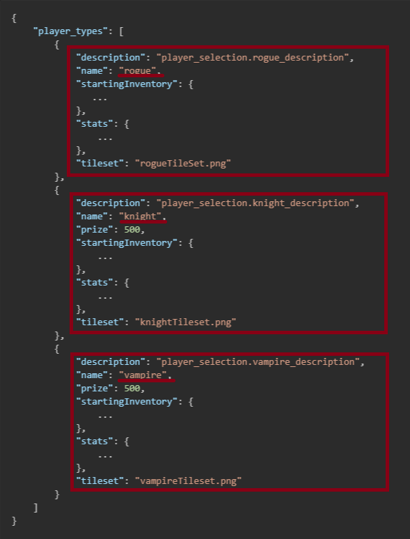
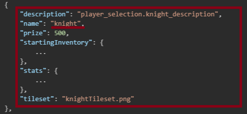
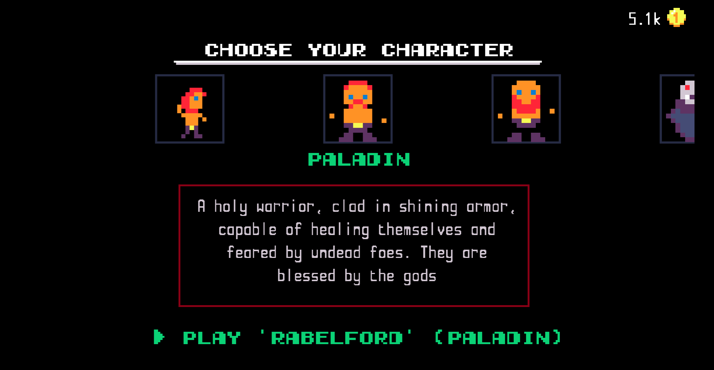
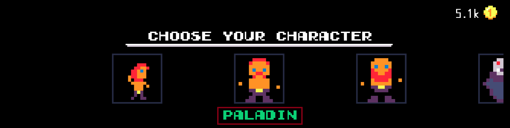
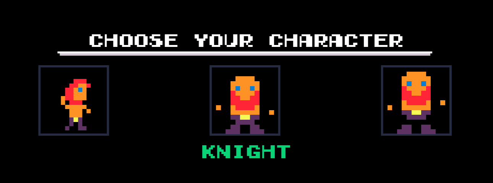
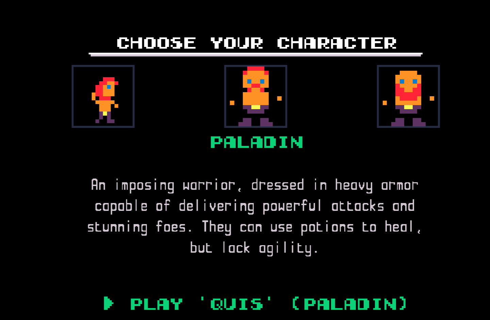

<a href="./index.md">back</a>

>If you stumble upon anything outdated, please reach out via [discord](https://discord.gg/uJjuuAH5uX)

# Adding the player to the game
Target of this chapture is to get the player appearing in the game, and to actually make it different. At the end of this page you will be able to choose the paladine character when you start a new game.

<p align="center">
  
</p>

# Adding paladine to the choosable player characters
If you have followed the first chapture you should already have a modfolder `paladin` (e.g. `.../mods/paladin`). It should also contain the tileset `paladin/graphics/paladin.png`.

In the same mod folder you should be able to locate the generated file `paladin/player/player-selection.mod.json`. Open it in a texteditor.

## player-selection.mod.json

This file contains some data which you might already be able to make sense of. It is a list of all the currently available playable characters (originaly `rogue`, `knight`, `vampire`). Lets have a look.

```json
{
    "player_types": [
        {
            "description": "player_selection.rogue_description",
            "name": "rogue",
            "startingInventory": {
               ...
            },
            "stats": {
                ...
            },
            "tileset": "rogueTileSet.png"
        },
        {
            "description": "player_selection.knight_description",
            "name": "knight",
            "prize": 500,
            "startingInventory": {
                ...
            },
            "stats": {
                ...
            },
            "tileset": "knightTileset.png"
        },
        {
            "description": "player_selection.vampire_description",
            "name": "vampire",
            "prize": 500,
            "startingInventory": {
                ...
            },
            "stats": {
                ...
            },
            "tileset": "vampireTileset.png"
        }
    ]
}
```

This might look complicated at first, but it is not, let me walk you trough.

> please note that in order to simplify stuff I replaced some list of properties with `...` to improve readability

## Main structure
As you can see in the file, there are currently 3 main sections in that file. Each of that section describes one of the currently playable characters. Lets have a look at the fields which are contained.



## Basic fields
Note that in each section we have the following basic fields
- description
- name
- price
- tileset



### Description
Description is the text which will be displayed in the Player Select Menu (compare with the image bellow). As the text has to be available in all languages it references to a translation file. Don't worry about this for now, we will take a closer look at that later.



### Name
This is the name / type of the playable character



### Prize
This is the prize the user has to pay initially to enable this player character, note that this field is empty for the rogue, as if the game is started for the first time there has to be at least one player available

### tileset
This field contains the name of the tileset which will be located in `paladin/graphics`. We will use this field to select which tileset should be used for this player character.

## Lets create the Paladin already!
Ok enough babbeling arround lets to this.

1. lets copy the knight config in `player-selection.mod.json` and paste it after the rogue

> note that you should use the values of the full file, I replaced some code bellow for readability!

```json
{
    "player_types": [
        {
            "description": "player_selection.rogue_description",
            "name": "rogue",
            ...
        },
        {
            "description": "player_selection.knight_description",
            "name": "knight",
            "prize": 500,
            "startingInventory": {
                ...
            },
            "stats": {
                ...
            },
            "tileset": "knightTileset.png"
        },
        {
            "description": "player_selection.knight_description",
            "name": "knight",
            "prize": 500,
            "startingInventory": {
                ...
            },
            "stats": {
                ...
            },
            "tileset": "knightTileset.png"
        },
        {
            "description": "player_selection.vampire_description",
            "name": "vampire",
            "prize": 500,
            ...
        }
    ]
}
```

2. check if our changes have been applied (we should see two knights now in the selection menu)
 - save your changes
 - start the game
 - open the mod menu
 - enable your paladin mod
 - hit keyboard [esc] or [start] on gamepad
 - start a new game
 - you should now see 2 knights

 <p align="center">
  
</p>

3. Lets change some values in the first knight
 - change the name to paladin
 - change the tilesetname to `paladin.png` -> make sure that it is identical to the paladin's .png file's name in `paladin/graphics/...`. Make sure that also the casing matches: `pladine-tileset.png` and `paladine-TileSet.png` are not the same and will cause issues!!

your second player config should now look exactly as shown bellow

```json
{
    "description": "player_selection.knight_description",
    "name": "paladin",
    "prize": 500,
    "startingInventory": {
        "armor": {},
        "items": [
            "apple",
            "apple",
            "strength",
            "defense"
        ]
    },
    "stats": {
        "base_armor": 1,
        "base_damage": 2,
        "can_dodge": 0,
        "can_use_secondaryWeapon": [
            "multi-tile"
        ],
        "can_wear_armor": true,
        "health": 15,
        "immuneToPoison": false,
        "lightRadius": 3,
        "moves_per_turn": 1,
        "regenerate_by_step": 0,
        "regenerate_on_attack": 0,
        "status_effects": [
            {
                "id": "stunned"
            }
        ]
    },
    "tileset": "paladin.png"
},
```
3. check if our changes have been applied (we should now see a paladin in the selection menu)
 - save your changes
 - start the game
 - open the mod menu
 - (make sure your paladin mod is (still) enabled)
 - hit keyboard [esc] or [start] on gamepad
 - start a new game
 - you should now see the paladin

<p align="center">
  
</p>

# Great now we are done right?
Not quit we created a kinght which does cross-play as a paladine as we only changed the name and how he looks. In the next section we will actually change how the paladin plays.

<a href="./edit-config.md" style="margin-left: 48px; font-size: 24px">-> next step</a>
