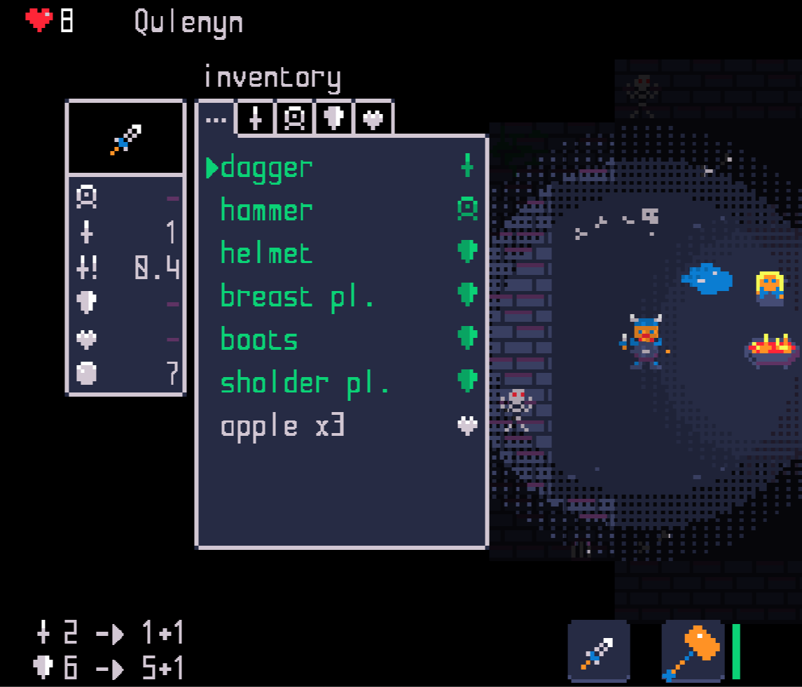

<a href="./adding-player.md">back</a>

>If you stumble upon anything outdated, please reach out via [discord](https://discord.gg/uJjuuAH5uX)

# Lets make the paladin different from the player
In order to make the paladin feel different to the knight, we will make use of some preexisting configurations. These are simple values which can be adjusted in the already known `player-selection.mod.json`.

We will:
1. add a default weapon which the paladin spawns with
2. add some different potions to the start inventory
3. increase the light radius with which the paladin starts
4. add a small increase of life per turn (if health is < 50%)

# Lets start with that
To begin open the `paladin/player/player-selection.mod.json` file in a texteditor and locate the newly added paladine object from last chapture. It will currently look as shown bellow. (as always I do not paste all lines but instead use `...` in order to simplify)
```json
{
    "player_types": [
        {
            "description": "player_selection.rogue_description",
            "name": "rogue",
            ...
        },
        {
            "description": "player_selection.paladin_description",
            "name": "paladin",
            "prize": 500,
            "startingInventory": {
                "armor": {},
                "items": [
                    "apple",
                    "apple",
                    "strength",
                    "defense"
                ]
            },
            "stats": {
                "base_armor": 1,
                "base_damage": 2,
                "can_dodge": 0,
                "can_use_secondaryWeapon": [
                    "multi-tile"
                ],
                "can_wear_armor": true,
                "health": 15,
                "immuneToPoison": false,
                "lightRadius": 3,
                "moves_per_turn": 1,
                "regenerate_by_step": 0,
                "regenerate_on_attack": 0,
                "status_effects": [
                    {
                        "id": "stunned"
                    }
                ]
            },
            "tileset": "paladin.png"
        },
        {
            "description": "player_selection.knight_description",
            "name": "knight",
            ...
        },
        {
            "description": "player_selection.vampire_description",
            "name": "vampire",
            ...
        }
    ]
}
```

Lets now have a quick look at the two fields: `startingInventory` and `stats`.

## startingInventory
The startingInventory field describes what this player character is carrying as he initially spawns. Here we can add potions and food, but also weapons and armor which can be equipped aswell. In order to make it clear how this would work - I show bellow the maximal possible configuration for a player which has fully equipped itself.

> Note that all the mentioned items need to be described in ItemConfig (as e.g. `"name": "dagger"`)

```json
...
"startingInventory": {
    "armor": [
        "helmet",
        "breast pl.",
        "boots",
        "sholder pl."
    ],
    "items": [
        "apple",
        "apple",
        "apple"
    ],
    "weapon": "dagger",
    "secondaryWeapon": "hammer"
},
...
```

This is how you would create a fully equipped player - as long he can actually use all of the equipped items - a rogue will not be able to where the armor.

The above example will result in this if you start now as a paladin:



# Ready to do some coding?
In the next chapture we will create two Comoponents using the component system. For that we will start with lua scripting.

<a href="./components.md" style="margin-left: 48px; font-size: 24px">-> next step</a>
