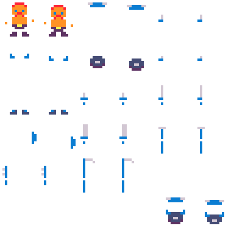
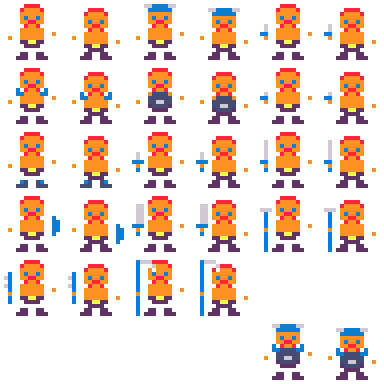
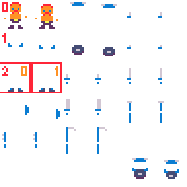

<a href="../index.md">back</a>

>If you stumble upon anything outdated, please reach out via [discord](https://discord.gg/uJjuuAH5uX)

# How to beginn
Create a new mod as shown in the [mod-creation section](../../mod-creation.md). Then come back here.

# Adding a new player character

There are multiple ways what one could understand as "creating a new player" in descent from arkovs Tower. Therefore I will list the steps which I will explain here.

# Creating the paladine
The Player character which we will create will be the paladine. Undead enemies are scared of him and might randomly fly or get stunned by his presencce. Other than that the palandine can wear armor (like the knight), drink potions and use ranged (stones / javelins) and multi tile weapons (like the hammer).

Steps:
1. create new player visibles (including weapons and armor) for a paladin character
2. make a new player character using only the visibles, rest is a copy of the knight
3. adjust some values in the players config
4. adapt some code so that undead enemies (skeletons, ghosts, skully) have a chance of fleeing from the paladin


# The new graphics
I decided to give the paladine a similar look as the knight. The paladine will not have a huge beard. but instead a mustache. Also he will have some hair left on his head. The rest we keep the same.

<p align="center">
  
</p>

As you can see I also had to draw all the equipment (armor and weapons) the player can possible equip. You have to imagine that in game I will layer all the items a player can visibly wear on top of the base character. Have a look at the second image.

> note that the two sprites in the bottom corner are only to visualies the whole armor set as the single tiles might interfier with each other, they are not needed and can be left blank

<p align="center">
  
</p>

# How do I know which of the equipments should go where in the file?
Good question. Lets have a look at this.

In the mod you created there is a player folder, enter that one and find the file: `your-mod-name/player/player-config.mod.json`. In that file you find all the informations you need, lets look at the boots. The boots should be at `x=0,y=2` and `x=1,y=2`. You can also find all the other equipment in there like `helmet`, `dagger` and so on.



```json
{
    "animations" : {
        "boots" : [
            {
                "x" : 0,
                "y" : 2
            },
            {
                "x" : 1,
                "y" : 2
            }
        ],
        "breats_plate" : [
            {
                "x" : 2,
                "y" : 1
            },
            {
                "x" : 3,
                "y" : 1
            }
        ],
        "dagger" : [
            {
                "x" : 4,
                "y" : 1
            },
            {
                "x" : 5,
                "y" : 1
            }
        ],
        "default" : [
            {
                "x" : 0,
                "y" : 0
            },
            {
                "x" : 1,
                "y" : 0
            }
        ],
        "helmet" : [
            {
                "x" : 2,
                "y" : 0
            },
            {
                "x" : 3,
                "y" : 0
            }
        ],
        
        ...

    }
}
```