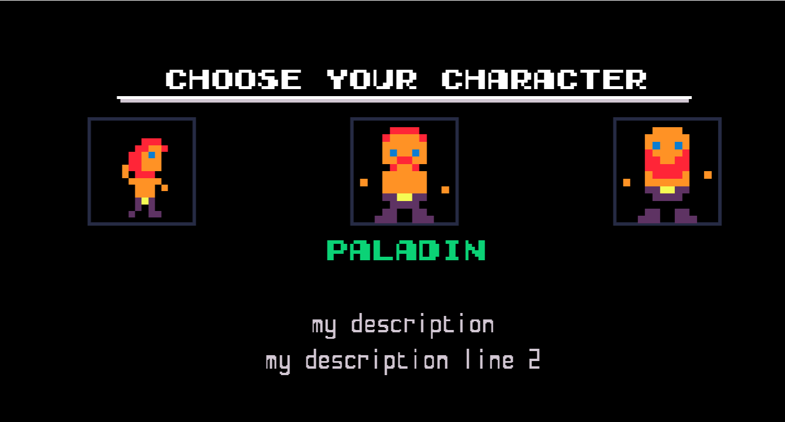
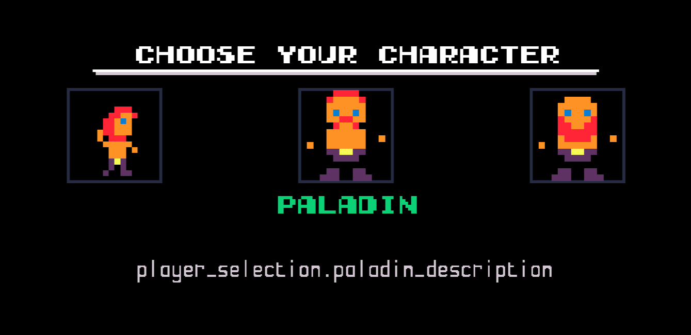
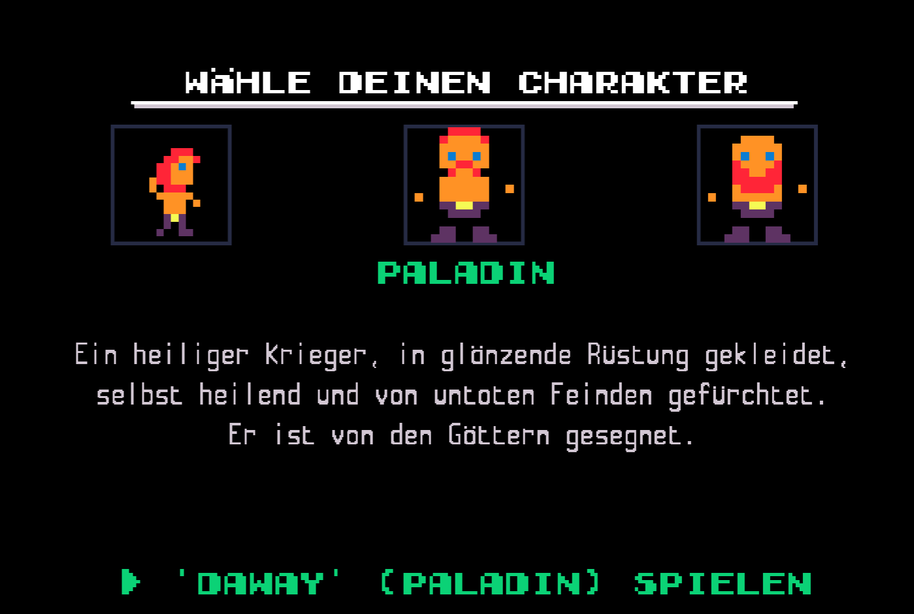
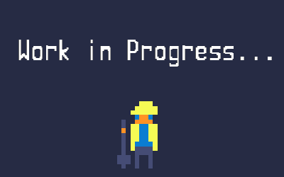

<a href="./edit-config.md">back</a>

>If you stumble upon anything outdated, please reach out via [discord](https://discord.gg/uJjuuAH5uX)

# Implement a unique play style for the paladin
In this chapture we will make the first part of the changes. We will edit the json `player-selection.mod.json` file, using already existing properties to change the gameplay of the paladin and make it different from the knight.

## Changing the description of the paladin
This can be made in an easy way, so that the description will not get translated, or in a slightly more complicated way, which will then translate to the users selected language. Lets look at the easier solution first.

### static non translatable derscription
1. open the `player-selection.mod.json` you already know
2. find our newly added section for the paladin (we added it in the last chapture)
3. lets adapt the field `description` as shown bellow:

> as usual I added some `...`'s to make it easier to read!

```json
{
    "player_types": [
        {
            "description": "player_selection.rogue_description",
            "name": "rogue",
            ...
        },
        {
            "description": "my description|my description line 2",
            "name": "paladin",
            ...
        },
        {
            "description": "player_selection.knight_description",
            "name": "knight",
            ...
        },
        {
            "description": "player_selection.vampire_description",
            "name": "vampire",
            ...
        }
    ]
}
```

4. lets test this as usual
    - save your changes in `player-selection.mod.json`
    - start the game
    - open the mod menu
    - make sure that the `paladin? mod is (still) enabled
    - hit keyboard [esc] or [start] on gamepad
    - start a new game
    - you should see the following description

<p align="center">
  
</p>

> as you can see the `|` character will seperate two lines of text.

Lets now adjust the description to one which makes sense:

`A holy warrior, clad in shining armor,|capable of healing themselves and|feared by undead foes. They are|blessed by the gods`

replace our placeholder text with this description. When you repeat the usual steps to test this, you should now see the correct description.

If you only plan to distribute to english users, you can skip to [the next part](./paladin-basic-changes.md#actual-gameplay-changes)

### translated solution
In order to translate the description based on the currently selected language, we need to make use of the localisation system. The localisation system uses `local-keys` in order to reference texts. It will then look for these keys in json files which can be found in the `paladin/local/de` and `paladin/local/en` files.

The german translation:
`Ein heiliger Krieger, in glänzende Rüstung gekleidet,|selbst heilend und von untoten Feinden gefürchtet.|Er ist von den Göttern gesegnet.`

The english translation:
`A holy warrior, clad in shining armor,|capable of healing themselves and|feared by undead foes. They are|blessed by the gods`

Now we need to do the following steps
1. decide on a `local-key` to use, lets go with: `player_selection.paladin_description`
2. replace our static text within the `player-selection.mod.json` with that key

```json
{
    "description": "player_selection.paladin_description",
    "name": "paladin",
    ...
}
```

3. lets see what happens if we start the game now
 - don't forget to recompile the mod by entering the mod menu before you start a new game
 - lets compare with the image bellow



That is the expected result as we did not yet provide a translation.

4. lets provide the german and english values for the new `local-key`.
    - find the file `paladin/local/de/translations/player-selection.json` and the according `en` file
    - add a new line in both files

paladin/local/de/translations/player-selection.json
```json
{
    "fields" : {
        ...
        "player_selection.paladin_description": "Ein heiliger Krieger, in glänzende Rüstung gekleidet,|selbst heilend und von untoten Feinden gefürchtet.|Er ist von den Göttern gesegnet." 
    },
    "file" : "player-selection"
}
```

paladin/local/en/translations/player-selection.json
```json
{
    "fields" : {
        ...
        "player_selection.paladin_description": "A holy warrior, clad in shining armor,|capable of healing themselves and|feared by undead foes. They are|blessed by the gods"
    },
    "file" : "player-selection"
}
```
<br>
<br>

>make sure to add a `,` after the last already existing line in the json field the end result should look like this (please not the `,` at the end of the line before your added line!)

<br>
<br>

```json
{
    "fields": {
        "player_selection.buy_type": "Buy ${type} (${price})",
        "player_selection.character_not_enabled": "you have not yet bought this character",
        "player_selection.knight_description": "An imposing warrior, dressed in heavy armor|capable of delivering powerful attacks and|stunning foes. They can use potions to heal,|but lack agility.",
        "player_selection.play_as": "Play '${name}' (${player})",
        "player_selection.rogue_description": "A swift thief, adept at ranged combat,|evading attacks, regenerating quickly,|and striking twice per round. They are a|deadly opponent that strikes from the shadows.",
        "player_selection.title": "Choose your character",
        "player_selection.vampire_description": "A creature of the night, feared for their|savage attacks and evasion. They regenerate|by drinking blood from their foes, eschewing|potions. A deadly predator feared in the dark.",
        "player_selection.paladin_description": "A holy warrior, clad in shining armor,|capable of healing themselves and|feared by undead foes. They are|blessed by the gods"
    },
    "file": "player-selection"
}
```

5. Lets test these changes
- don't forget to recompile the mod by opening and closing the mod menu before starting a new game
- if you get weird errors pointing to json -> make sure all `,` and `"` are exactly where thy have to be!
- the result should now look like this for german, and of course showing the english translation if the language is set to english



# Actual gameplay changes

<p align="center">
  
</p>