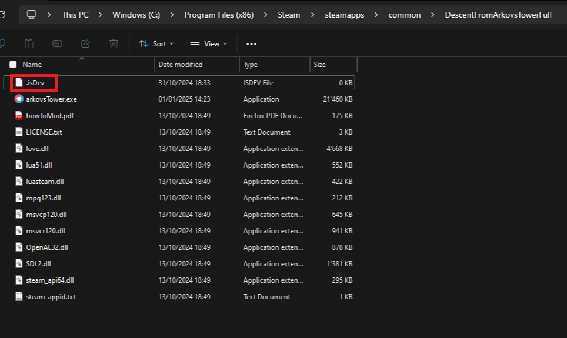
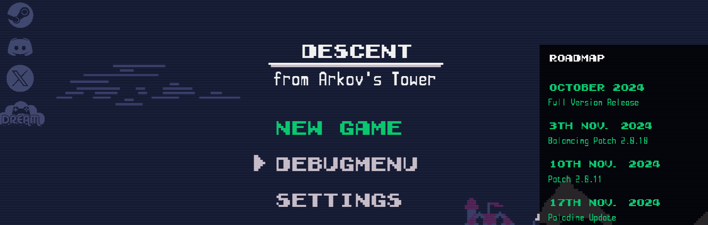

<a href="../index.md">back</a>

# Devmod
In this chapture I will show you the usefull dev mode. This enables some debugging tools which make your life easier.

1. add a level quick select tool which allows you to start any level without having to fight trough the levels before, perfect to test changes in a specific level.
2. Better logging
3. Game crashes on some warnings with an error -> see where your mod isn't omptimalized

# How to enable
The devmod gets enabled by adding a .isDev in the right place.

## enable
1. open Steam
2. navigate to Descent from Arkovs Tower
3. On the Cogweel on the right click `manage` then `Browse local files`.
4. In the folder which opened, add an empty file called `.isDev`

## test if it works
1. restart the game
2. you should now see a new option `Debugmenu` in the Main Menu

## Using the Debug menu
The debug menu allows you to start any level in any difficulty. Just give it a try.