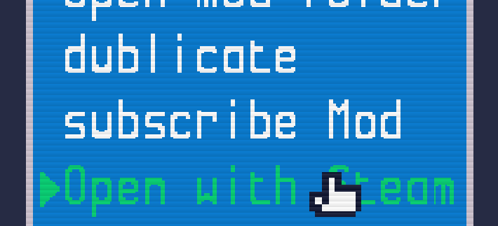

<a href="../index.md">back</a>

>If you stumble upon anything outdated, please reach out via [discord](https://discord.gg/uJjuuAH5uX)

# Publishing Mods

This guide will walk you through the process of publishing your Mod to the Steam Workshop.

> Disclaimer: MAC Users do not have access to the Workshop from in game...

## Step 1: Create your own Mod
For learning purposes or to see how easy it is, just create a new Mod now as described [here](../mod-creation.md), later you want to create your own mod by editing the default "newMod" (as described [here](../creating-new-mods/index.md)) first.

## Step 2: Test your Mod
Just make sure that your Mod is working as intended.

## Step 3: Publish your Mod
You can simply publish your Mod by choosing the dropdown option "publish Mod".

This will automatically take care of everything.

## Step 4: Check out your current Mod on the Workshop
This is as simple as using the Dropdown again, but now select "Open in Steam"

This will open the published Steam items page. Here you can manage e.g. the Mod's visibility. 

## Step 5 decide on the visibility

On the Workshop page of your Mod, you can decide if the Mod is visible. By default it will be hidden and only you will be able to see the Mod.

- Hidden - default! (keep this if your Mod is not yet ready or only a test Mod)
- Friends only (only your Steam friends will be able to see and use your Mod - e.g. for a closed beta test of the Mod)
- Public (everyone will be able to see, use and rate your Mod)

# Edit the Mod
By default when you initially click "publish Mod" a few files are created within the Mod folder. This can be edited in order to change how the mod appears in the Workshop.

In order to edit those, open the Mod's folder by using the dropdown action "open mod folder" from the in game modmenu.

There are the two files which have been generated by pressing "publish mod" earlier:
- meta.json (holds information like Mod's title, description and so one)
- preview.png (the preview of the Mod used on the steam workshop)

Edit these to your content

## Update

Updating your Mod to a new version is then as easy as selecting the dropdown options "publish changes".

1. make sure your Mod is not subscribed (unsubscribe otherwise)
2. make sure you did not edit the modname or the steam id within the meta.json
3. use "publish changes" from the dropdown

If the option is not available:
- you might have edited a value in the meta.json which is not possible (Modname or steam id).
- make sure that you are not subscribed in order to be able to update
