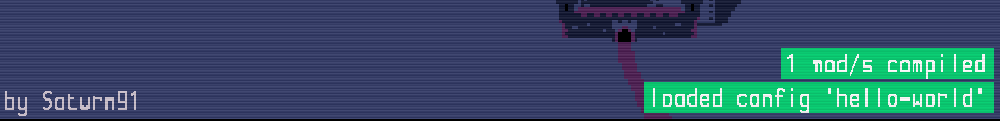

<a href="../index.md">back</a>

>If you stumble upon anything outdated, please reach out via [discord](https://discord.gg/uJjuuAH5uX)

# Steam 

> Disclaimer: MAC Users do not have access to the Workshop from in game...

Descent from Arkov's Tower uses the Steamworkshop available to acquire and share mods. This is a service which Steam offers to all its customers.

In the following Section you will learn how you can download mods, and how to make your mods available on the Workshop for other users.

## Subscribing / Installing Mods
Subscribing to a mod allows you to play that mod. By subscribing to a mod, you will make it visible in your Modmanager.

Let's subscribe to a mod.

1. Start Descent from Arkovs Tower
2. In the Mainmenu select "Mods"
3. The Modmanager will open.
4. Select "tools/open workshop"
5. The Steam workshop will open in your Browser, you will see a list of the most popular mods
6. Click on a mod that sounds interesting to you
7. Select "Subscribe" to make the Mod available in your game
8. Open the game (which was running in the Background)
9. Select "tools/refresh mods"
10. The mod you selected should appear in the modlist.

This mod is now available on your computer, but not yet ready to play. In order to enable the mod, you need to select it. In the Dropdown you then "enable" the mod. Alternatively, you can enable it using the checkbox. In both cases, it should afterwards look like the picture below.

After navigating back to the game (Escape key or by using the Back or Home Button) you will get a Message in the bottom right telling you that 1 mod has been installed. The modded content will be available as soon as you start a new game.

